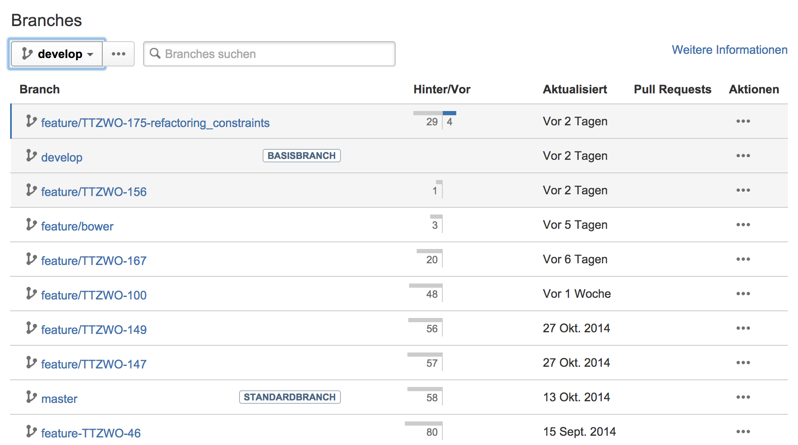

# git-workshop

## Agenda

* Introduction
    * Introduction of participants
    * Check agenda, expectations and wishes
    * Installation and basic configuration
    * Conceptional overview
* Fundamentals I - Local usage
    * Basic commands
    * Comparison with SNV
    * Staging Area
    * Revert changes
* Fundamentals II - Distributed usage
    * Bitbucket Server as central repository
    * Commands for distributed usage
    * Walk-through for Bitbucket Server
* Fundamentals III - Branching/Merging
    * Commands and Concepts
    * Workflows and Support in Stash
* Pitfalls and Best-Practices
* GUI-Tools and IDE-Plugins
* Advanced features (depending on use cases or intrest)
    * Tagging
    * History Rewriting
    * Track changes
    * Cherry Picking
* Perspectives

## Installation and basic configuration

* git project page: [git-scm.com](http://git-scm.com/)
* Windows
    * Download and run installer 
    * Select option **Use Git from the Windows Command Prompt**
    * Open  **Windows PowerShell**
* Mac/Linux
    * Download and run installer 
    * Open **Terminal**
* Shell Plugins 
    * Bash: https://github.com/revans/bash-it
    * Fish + https://github.com/bpinto/oh-my-fish
    * ZSH + https://github.com/robbyrussell/oh-my-zsh 
*  GUIs
    * Eclipse - http://eclipse.org/egit/
    * SourceTree - www.sourcetreeapp.com/download  

### Basic commands

`git init|add|rm|commit|status|log`

    mkdir git-hello-world
    cd git-hello-world
    git init
    ls -la
    git status
    
    # only mac/linux (Windows: use notepad)
    echo "hello world" >> hello-world.txt
    git add hello-world.txt
    git status
    git rm hello-world.txt
    git rm --cached hello-world.txt
    git commit -m "my first commit"
    
    ## Author and email
    git config --global user.email "myemail@example.com"
    git config --global user.name "My Username"
    
    # Commit again with a new name
    git commit --amend --reset-author
    
    git log
    # Where is the revision number?

	# help
	git help commit
	
	# ignore files
	echo ".DS_Store" >> .gitignore
	git add .gitignore
	git commit -m "Add .gitignore"

### The staging agea

`git diff|reset|checkout`

([Image Source: Pro Git by Scott Chacon](http://www.progit.couchone.com/progit/_design/chacon/_show/chapter/01-chapter2))

    git status
    
    # modify file
    git status
    git diff
    
    git add <filename>
    git status
    git diff
    
    ## modify file
    git diff
    git diff -r head
    
    git reset head <filename>
    git status
    
    git add <filename>
    git status
    
    git checkout head <filename>
    git status
    
    ## short command
    git commit -a -m "important change"
    
    # add with patch mode
    git add -p

### Distributed usage

`git clone|pull|push|(fetch)`

    git clone <repository-url>
    cd <repository-name>
    git status

#### Example project

[https://github.com/tilmanpotthof/git-workshop-english](https://github.com/tilmanpotthof/git-workshop-english)

    git clone https://github.com/tilmanpotthof/git-workshop-english
    cd git-workshop-english
    git status

#### Exercise: Add your name, job position and a question

... either as JSON or Java code

* JSON - Open to following folder
   * `javaee7-wildfly-example/src/main/webapp/workshopParticipants/`
   * Copy the file `participant-0.json`
   * Change the file name to `participant-${NEXT_NUMBER}.json`
   * Change the content

* Java - Open the following file (max. 2-3 people)
   * `javaee7-wildfly-example/src/main/java/de/tilmanpotthof/workshop/ExampleWebservice.java`
   * Create an new Object `WorkshopParticipant`
   * Add it to the list

#### Change repository to your Bitbucket Server

`git remote add|rm|set-url`

Special setup to keep changes private.

    git remote -v
    git remote set-url origin <new-repository>
    
    git remote add public-github https://github.com/tilmanpotthof/git-workshop-english
    
    git pull public-github master
    
    git remote -v

## Branching and Merging

### Commands

    git checkout -b experimental/xy
    
    # long version
    git branch experimental/xy
    git checkout experimental/xy
    
    git add .
    git status
    git commit -m "..."
    
    git branch -a
    
    git checkout master
    
    git rebase experimental
    
    ## checkout remote branch
    git checkout experimental/zzz
    
    ## push to remote
    git push -u origin experimental/xy
    
    ## WARNING - Don't push to other remote branches
    
    # zurück mergen
    git checkout master
    

#### Branching and Merging with Bitbucket Server

##### Create Branch

##### Branch Overview

#### Pull Requests

## Pitfalls and Good Practices

* Common Pitfalls
    * Forget to push (`git push`)
    * Naive merging -- Toughless overwrite of server changes 
    * Merging without conflict can still produce errors
    * Repository partitioning in multi module projects
* Bad Practice
    * Public History-Rewriting - YOU SHALL NOT DO THAT [RFC 2119 - IETF](https://www.ietf.org/rfc/rfc2119.txt)
    * `git push --force` (Prohibit in Bitbucket)
* Good Practices
    * Commit as often as it makes sence (at least stage changes)
    * Keep features branches in sync with the `develop` branch
    * Don't commit generated files (build results, dependecies etc.)

## Further features / concepts

### git flow

* https://www.atlassian.com/git/tutorials/comparing-workflows/gitflow-workflow/

### Config

    cat .git/config
    git config user.email "tpotthof@seibert-media.net"
    git config user.name "Tilman Potthof"

### Advanced Log

    git log --all --date-order --pretty=format:"%h%x09%an%x09%ad%x09%s"
    
    # source: http://stackoverflow.com/questions/1057564/pretty-git-branch-graphs
    [alias]
    lg1 = log --graph --abbrev-commit --decorate --date=relative --format=format:'%C(bold blue)%h%C(reset) - %C(bold green)(%ar)%C(reset) %C(white)%s%C(reset) %C(dim white)- %an%C(reset)%C(bold yellow)%d%C(reset)' --all
    lg2 = log --graph --abbrev-commit --decorate --format=format:'%C(bold blue)%h%C(reset) - %C(bold cyan)%aD%C(reset) %C(bold green)(%ar)%C(reset)%C(bold yellow)%d%C(reset)%n''          %C(white)%s%C(reset) %C(dim white)- %an%C(reset)' --all
    lg = !"git lg1"

### Advanced Diff

    git diff --word-diff
    git diff -r head~3 -- <path>
    git diff -r head~3 -- javaee7-wildfly-example/
    git diff --word-diff --word-diff-regex='[^[:space:]]' embed.plnkr.co/
    

### Stash

    git stash
    git stash apply
    git stash pop
    git stash list
    git checkout stash@{0} -- <path>
    git diff -r stash@{0} -- <path>
    git diff -r stash@\{0\} --stat

### Tagging

    git tag <tag>
    git tag v1.0
    git tag --list
    git tag --delete v1.0
    git push origin --tags
    git push origin v1.0

### History Rewriting

    git commit --amend
    git rebase -i HEAD~4
    
### ???

    git gc
    git fsck
    git reflog
    git diff --word-diff --word-diff-regex='[^[:space:]]'
    git format-patch feature/JUVE-1945-feedback-auf-mandantenmail-dokumentieren > feedbackClient
    git log --follow -S '{{nobilityTitle.nobilityTitles}}' -- src/main/webapp/js/app/person/view/person-view.html