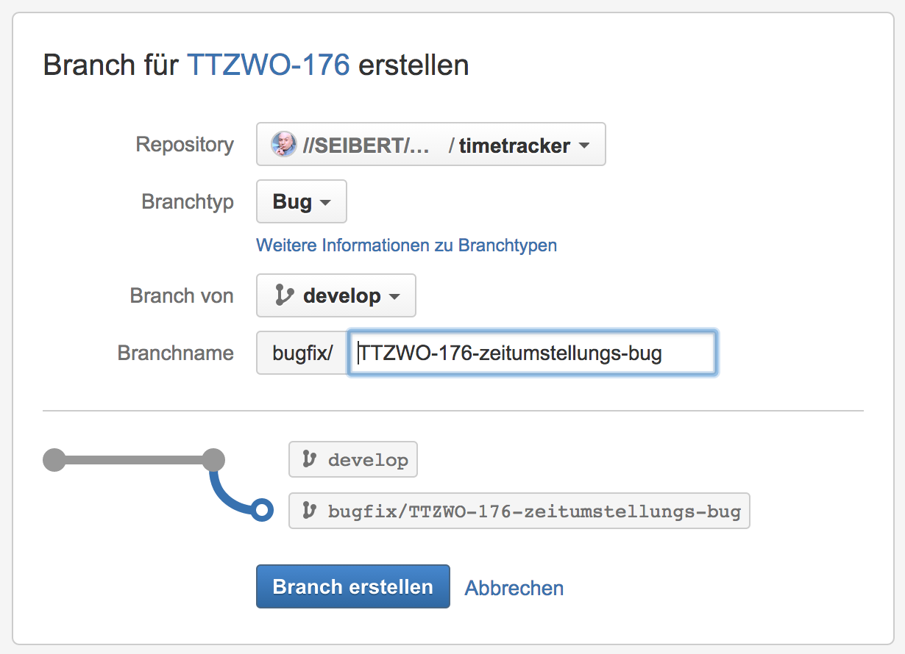

# git-workshop

## Agenda

* Einführung
    * Kurze Vorstellung der Teilnehmer
    * Kurze Vorstellung der Agenda mit Abklärung der Erwartungen und Wünsche
    * Installation und grundlegende Konfiguration
    * Überblick über die Konzepte
* Grundlagen I - Lokales Arbeiten 
    * Basis-Befehle
    * Konzeptioneller Vergleich mit SVN
    * Arbeiten mit der Staging Area
    * Zurücksetzen von Änderungen
* Grundlagen II - Verteiltes Arbeiten
    * Bitbucket Server als zentrales Repository
    * Befehle zum verteilten Arbeiten
    * Einführung in die Oberfläche von Bitbucket Server
* Grundlagen III - Branching/Merging
    * Befehle und Konze pte
    * Workflows und Unterstützung in Bitbucket Server
* Fallstricke und Good-Practices
* Grafische git-Tools und IDE-Plugins
* Weitere Funktionen (nach Bedarf und Interesse)
    * Tagging
    * History Rewriting
    * Zurückverfolgen von Änderungen
    * Cherry-Picking
* Ausblick

## Installation und grundlegende Konfiguration

* git Projektseite: [git-scm.com](http://git-scm.com/)
* Windows
    * Installer herunterladen und starten
    * Option wählen **Use Git from the Windows Command Prompt**
    * Programm **Windows PowerShell** öffnen
* Mac/Linux
    * Installer herunterladen und starten
    * Programm **Terminal** öffnen
* Shell Plugins 
    * Bash: https://github.com/revans/bash-it
    * Fish + https://github.com/bpinto/oh-my-fish
    * ZSH + https://github.com/robbyrussell/oh-my-zsh 
*  GUIs
    * Eclipse - http://eclipse.org/egit/
    * SourceTree - www.sourcetreeapp.com/download  

### Basis-Befehle

`git init|add|rm|commit|status|log`

    mkdir git-hallo-welt
    cd git-hallo-welt
    git init
    ls -la
    git status
    
    # nur mac/linux - windows datei anlegen
    echo "hallo welt" >> hallowelt.txt
    git add hallowelt.txt
    git status
    git rm hallowelt.txt
    git rm --cached hallowelt.txt
    git commit -m "mein erster commit"
    
    ## Author und Email
    git config --global user.email "myemail@example.com"
    git config --global user.name "My Username"
    
    # Commit mit neuem Namen ändern
    git commit --amend --reset-author
    
    git commit -m "mein erster commit"
    git log
    # Hilfe wo ist die Revisionsnummer? (Short Hash)

	# hilfe
	git help commit
	
	# ignorieren von dateien
	echo ".DS_Store" >> .gitignore
	git add .gitignore
	git commit -m "ignore datei hinzugefügt."

### Arbeiten mit der Staging Area

`git diff|reset|checkout`

([Image Source: Pro Git by Scott Chacon](http://www.progit.couchone.com/progit/_design/chacon/_show/chapter/01-chapter2))

    git status
    
    # datei bearbeiten
    git status
    git diff
    
    git add <dateiname>
    git status
    git diff
    
    ## datei bearbeiten
    git diff
    git diff -r head
    
    git reset head <dateiname>
    git status
    
    git add <dateiname>
    git status
    
    git checkout head <dateiname>
    git status
    
    ## abkürzung
    git commit -a -m "wichtige änderung"
    
    # partial add
    git add -p

### Befehle zum verteilten Arbeiten

`git clone|pull|push|(fetch)`

    git clone <repository-url>
    cd <repository-name>
    git status

#### Beispiel Projekt

[https://github.com/tilmanpotthof/git-workshop](https://github.com/tilmanpotthof/git-workshop)

    git clone https://github.com/tilmanpotthof/git-workshop
    cd git-workshop
    git status

#### Aufgabe: Name, Rolle und Fragen eintragen

... entweder als JSON-Datei oder in Java-Code:

* JSON - Folgenden Ordner öffnen
   * `javaee7-wildfly-example/src/main/webapp/workshopParticipants/`
   * Datei `participant-0.json` kopieren
   * Dateinamen in `participant-${NAECHSTER_INDEX}.json`ändern
   * Inhalte ändern

* Java - Folgende Datei öffnen (max. 2-3 Personen)
  * `javaee7-wildfly-example/src/main/java/de/tilmanpotthof/workshop/ExampleWebservice.java`
  * Neues Objekt `WorkshopParticipant` erzeugen
  * Das Objekt zu der Liste hinzufügen

#### Repositorys für Bitbucket Server anpassen

`git remote add|rm`

Besonderheit, um Änderungen privat zu halten. Normalerweise nicht notwendig.

    git remote -v
    git remote rm origin
    git remote add origin <new-repository>
    ## push and set upstream
    git push -u origin master
    
    git remote add public-github https://github.com/tilmanpotthof/git-workshop
    
    git pull public-github master

## Branching und Merging

### Befehle

    git checkout -b experimental/xy
    
    # lange version
    git branch experimental/xy
    git checkout experimental/xy
    
    git add .
    git status
    git commit -m "..."
    
    git branch -a
    
    git checkout master
    
    git rebase experimental
    
    ## checkout remote branch
    git checkout experimental/zzz
    
    ## push to remote
    git push -u origin experimental/xy
    
    ## achtung - NICHT in anderen remote branches pushen!!!
    
    # zurück mergen
    git checkout master
    

#### Branching und Merging mit Bitbucket Server

##### Branch erstellen

##### Branch Übersicht

#### Pull Requests

## Fallstricke und Good-Practices

* Fallstricke
    * Vergessen von `git push` 
    * Naives Merging -- Server Änderungen einfach überschreiben.
    * Merging ohne Konflikte kann auch Fehler produzieren
    * Zu kleine oder zu große Repositories
* Bad Practice
    * Public History-Rewriting - YOU SHOULD NOT DO THAT [RFC 2119 - IETF](https://www.ietf.org/rfc/rfc2119.txt)
    * `git push --force` (In Bitbucket Server verbieten)
* Good-Practices
    * Oft committen oder stagen
    * Feature-Branches in Sync mit `develop` halten
    * Generierte Dateien nicht committen (Build Artefakte, Abhängigkeiten etc.)

## Weitere Funktionen / Konzepte

### git flow

* https://www.atlassian.com/git/tutorials/comparing-workflows/gitflow-workflow/

### Config

    cat .git/config
    git config user.email "tpotthof@seibert-media.net"
    git config user.name "Tilman Potthof"

### Advanced Log

    git log --all --date-order --pretty=format:"%h%x09%an%x09%ad%x09%s"
    
    # source: http://stackoverflow.com/questions/1057564/pretty-git-branch-graphs
    [alias]
    lg1 = log --graph --abbrev-commit --decorate --date=relative --format=format:'%C(bold blue)%h%C(reset) - %C(bold green)(%ar)%C(reset) %C(white)%s%C(reset) %C(dim white)- %an%C(reset)%C(bold yellow)%d%C(reset)' --all
    lg2 = log --graph --abbrev-commit --decorate --format=format:'%C(bold blue)%h%C(reset) - %C(bold cyan)%aD%C(reset) %C(bold green)(%ar)%C(reset)%C(bold yellow)%d%C(reset)%n''          %C(white)%s%C(reset) %C(dim white)- %an%C(reset)' --all
    lg = !"git lg1"

### Advanced Diff

    git diff --word-diff
    git diff -r head~3 -- <path>
    git diff -r head~3 -- javaee7-wildfly-example/
    git diff --word-diff --word-diff-regex='[^[:space:]]' embed.plnkr.co/
    
### Advanced Stageing

    # Aehnlich zu git add -p, patch option existiert auch im Interaktiven Modus
    git add -i 

### Stash

    git stash
    git stash apply
    git stash pop
    git stash list
    git checkout stash@{0} -- <path>
    git diff -r stash@{0} -- <path>
    git diff -r stash@\{0\} --stat

### Tagging

    git tag <tag>
    git tag v1.0
    git tag --list
    git tag --delete v1.0
    git push origin --tags
    git push origin v1.0

### History Rewriting

    git commit --amend
    git rebase -i HEAD~4
    
### ???

    git gc
    git fsck
    git reflog
    git diff --word-diff --word-diff-regex='[^[:space:]]'
    git format-patch feature/JUVE-1945-feedback-auf-mandantenmail-dokumentieren > feedbackClient
    git log --follow -S '{{nobilityTitle.nobilityTitles}}' -- src/main/webapp/js/app/person/view/person-view.html
